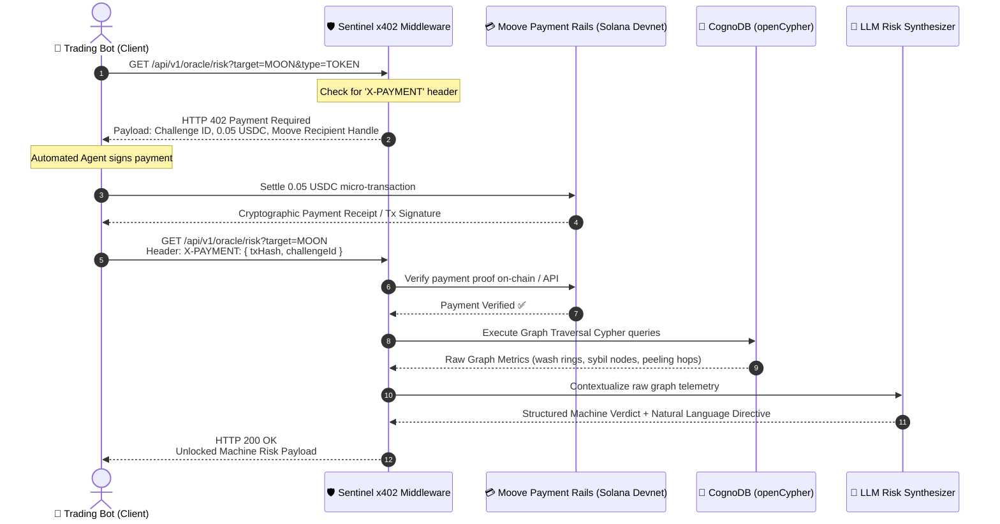

# 🛡️ Sentinel: The Agent-to-Agent x402 Risk Oracle

[](https://bun.sh)
[](https://nestjs.com)
[](https://cognodb.com)
[](https://moove.xyz)

> **Autonomous On-Chain Risk Oracle for AI Trading Agents.** Evaluates DeFi wash-trading rings, Sybil sniper farms, and laundering peeling chains using a managed **CognoDB openCypher** graph database, monetized via **HTTP 402 ("Payment Required")** micro-transactions settled through **Moove Agentic Payments**.

---

## 1. The Core Problem & Solution

AI trading agents execute swaps on DEXs (e.g., Solana) based solely on price feeds and basic liquidity, making them vulnerable to on-chain fraud patterns:

- **Circular Wash-Trading Rings:** Artificial loops inflating volume.
- **Sybil Sniping Farms:** Mastermind wallets funding dozens of puppet bots to front-run and dump.
- **Laundering Peeling Chains:** Rapid multi-hop fund splitting exiting into CEX deposit wallets.

Traditional APIs require credit cards, KYC, or human SaaS subscription management that autonomous machines cannot satisfy. **Sentinel solves this by turning risk intelligence into a machine-to-machine, pay-per-compute x402 service.**

---

## 2. End-to-End Sequence



---

## 3. Monorepo Structure

```
sentinel-oracle/
├── backend/                  # NestJS + Bun API with x402 guard & CognoDB service
│   ├── src/
│   │   ├── common/           # x402 guard, TypeBox validation pipe, custom exceptions
│   │   ├── database/         # CognoDB driver & openCypher traversal queries
│   │   ├── moove/            # Moove challenge creation & settlement verification
│   │   ├── ai/               # LLM structured risk synthesizer
│   │   ├── oracle/           # /api/v1/oracle/risk endpoint
│   │   └── seed/             # Deterministic test clusters ($MOON wash loop, $SAFE)
│   └── test/                 # Bun unit tests
├── client-agent/             # Autonomous CLI trading bot simulator
│   └── demo-trader-bot.ts    # Demonstrates automated 402 negotiation & unlocked execution
├── frontend/                 # Interactive React + Vite + Tailwind dashboard
│   └── src/
│       ├── components/
│       │   ├── AgentSimulator.tsx   # 1-Click interactive judge demonstration
│       │   ├── RiskRadar.tsx        # Visual radar & graph anomaly breakdown
│       │   └── TelemetryStream.tsx  # Live M2M terminal event feed
├── .husky/                   # Commitlint and lint-staged git hooks
├── AGENTS.md                 # Architectural rules and strict TypeScript standards
├── SENTINEL_BLUEPRINT.md     # Full architectural blueprint
└── package.json              # Monorepo workspaces configuration
```

---

## 4. Quickstart Guide

### Prerequisites

- [Bun](https://bun.sh) (v1.1+ or v1.2+)

### 1. Install Dependencies

```bash
bun install
```

### 2. Configure Environment

```bash
cp backend/.env.example backend/.env
```

_(Default settings use mock mode for local testing without needing active API keys)_

### 3. Run Backend Server

```bash
bun run dev
# Or: cd backend && bun run dev
```

Sentinel Oracle will boot on `http://localhost:3000`.

### 4. Run Frontend Dashboard

```bash
cd frontend && bun run dev
```

Visit `http://localhost:5173` to explore the interactive visual terminal!

### 5. Run Standalone Autonomous Client Agent

```bash
bun run agent:demo
# Or inspect benign token:
bun run client-agent/demo-trader-bot.ts SAFE
```

---

## 5. Verification & Testing

Run unit tests across backend services and guards:

```bash
bun run test
```

---

## 6. License

MIT License. Built for the Moove Agentic Payments Hackathon.
