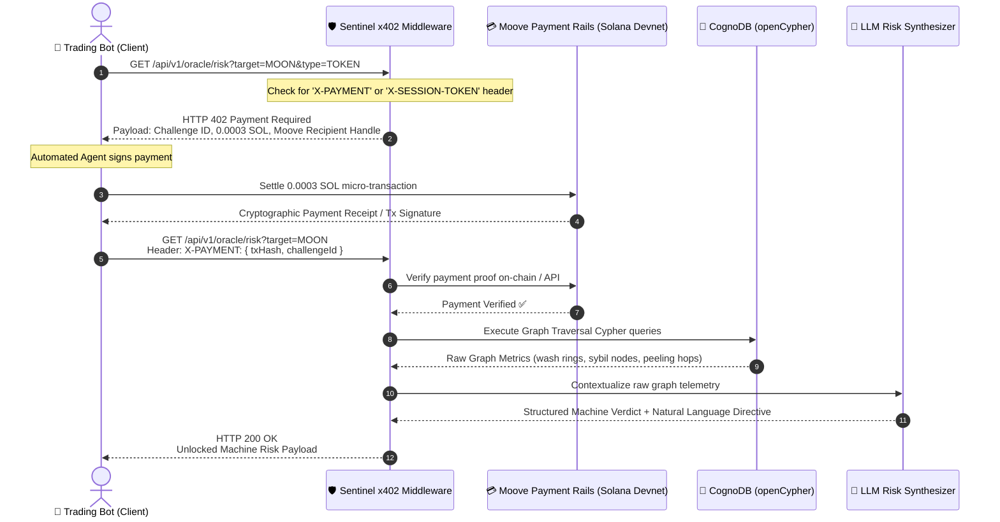

# 🛡️ Sentinel: The Agent-to-Agent x402 Risk Oracle

[](https://bun.sh)
[](https://nestjs.com)
[](https://cognodb.com)
[](https://moove.xyz)
[](https://solana.com)
[](https://github.com/sendaifun/solana-agent-kit)

> **Autonomous On-Chain Risk Oracle for AI Trading Agents.** Evaluates DeFi wash-trading rings, Sybil sniper farms, and laundering peeling chains using a managed **CognoDB openCypher** graph database, monetized via **HTTP 402 ("Payment Required")** micro-transactions settled through **Moove Agentic Payments**.

---

## 1. The Core Problem & Solution

AI trading agents execute swaps on DEXs (e.g., Solana) based solely on price feeds and basic liquidity, making them vulnerable to on-chain fraud patterns:

- **Circular Wash-Trading Rings:** Artificial loops inflating volume.
- **Sybil Sniping Farms:** Mastermind wallets funding dozens of puppet bots to front-run and dump.
- **Laundering Peeling Chains:** Rapid multi-hop fund splitting exiting into CEX deposit wallets.

Traditional APIs require credit cards, KYC, or human SaaS subscription management that autonomous machines cannot satisfy. **Sentinel solves this by turning risk intelligence into a machine-to-machine, pay-per-compute x402 service.**

---

## 2. End-to-End Sequence



---

## 3. Key Features

### 🔌 SendAI Plugin (solana-agent-kit)

Drop-in Sentinel risk assessment for any SendAI-powered autonomous agent:

```typescript
import {
  assessTokenRisk,
  buySessionPass,
  safeSwap,
} from "./plugins/sendai-sentinel.js";

// Pre-flight risk check before Jupiter swap
const verdict = await assessTokenRisk(connection, keypair, {
  target: "MOON",
  type: "TOKEN",
});

if (verdict.oracleVerdict.canExecute) {
  await executeSwap(); // Safe to trade
} else {
  console.log("🚨 Fraud detected — capital protected");
}
```

### ⚡ x402 Session Passes

High-frequency agents can purchase a **Session Pass** (0.01 SOL → 100 queries / 24h) to eliminate per-query on-chain settlement overhead:

```bash
# Autonomous trader with session pass
bun run agent:session

# Or programmatically
const pass = await buySessionPass(connection, keypair, { oracleUrl });
// Use pass.sessionToken as X-SESSION-TOKEN header for zero-latency queries
```

### 📡 Live On-Chain Ingestion

Real-time Solana DEX event streaming into the CognoDB graph database:

- **Raydium AMM v4** pool creation and swap events
- **Pump.fun** bonding curve launches
- Continuous `MERGE` of wallet nodes and transfer edges
- Simulation mode for local development without paid RPC endpoints

---

## 4. Monorepo Structure

```
sentinel-oracle/
├── backend/                  # NestJS + Bun API with x402 guard & CognoDB service
│   ├── src/
│   │   ├── common/           # x402 guard, TypeBox validation pipe, custom exceptions
│   │   ├── database/         # CognoDB driver & openCypher traversal queries
│   │   ├── moove/            # Moove challenge creation & settlement verification
│   │   ├── ai/               # LLM structured risk synthesizer (Gemini)
│   │   ├── oracle/           # /api/v1/oracle/risk endpoint + Session Pass service
│   │   ├── ingestion/        # Live Solana DEX event → CognoDB ingestion worker
│   │   └── seed/             # Deterministic test clusters ($MOON wash loop, $SAFE)
│   └── test/                 # Bun unit tests
├── client-agent/             # Autonomous CLI trading bot simulator
│   ├── src/
│   │   ├── plugins/
│   │   │   └── sendai-sentinel.ts  # SendAI solana-agent-kit plugin
│   │   ├── autonomous-trader.ts    # Full A2A trader with session pass support
│   │   ├── wallet.ts               # Solana keypair management
│   │   ├── jupiter.ts              # Jupiter DEX quote & swap execution
│   │   └── monitor.ts              # Liquidity event stream
│   ├── demo-trader-bot.ts          # Quick hackathon demo
│   └── demo-sendai-trader.ts       # SendAI plugin demo
├── frontend/                 # Interactive React + Vite + Tailwind dashboard
│   └── src/
│       ├── components/
│       │   ├── AgentSimulator.tsx   # 1-Click interactive judge demonstration
│       │   ├── RiskRadar.tsx        # Visual radar & graph anomaly breakdown
│       │   └── TelemetryStream.tsx  # Live M2M terminal event feed
├── .husky/                   # Commitlint and lint-staged git hooks
├── AGENTS.md                 # Architectural rules and strict TypeScript standards
├── SENTINEL_BLUEPRINT.md     # Full architectural blueprint
├── TWITTER_PLAYBOOK.md       # Twitter momentum strategy & recording guide
└── package.json              # Monorepo workspaces configuration
```

---

## 5. Quickstart Guide

### Prerequisites

- [Bun](https://bun.sh) (v1.1+ or v1.2+)

### 1. Install Dependencies

```bash
bun install
```

### 2. Configure Environment

```bash
cp backend/.env.example backend/.env
```

_(Default settings use mock mode for local testing without needing active API keys)_

### 3. Run Backend Server

```bash
bun run dev
# Or: cd backend && bun run dev
```

Sentinel Oracle will boot on `http://localhost:3000`.

### 4. Run Frontend Dashboard

```bash
cd frontend && bun run dev
```

Visit `http://localhost:5173` to explore the interactive visual terminal!

### 5. Run Autonomous Agents

```bash
# Classic hackathon demo
bun run agent:demo

# Full autonomous A2A trader (continuous monitoring)
bun run agent:live

# SendAI plugin demo
bun run agent:sendai

# A2A trader with Session Pass (100 queries / 24h)
bun run agent:session

# Single target check
bun run agent:live SAFE
bun run agent:sendai MOON
```

---

## 6. API Reference

### Risk Assessment (x402 Protected)

```
GET /api/v1/oracle/risk?target=MOON&type=TOKEN
```

**Headers (choose one):**

| Header            | Description                                                |
| ----------------- | ---------------------------------------------------------- |
| `X-PAYMENT`       | JSON receipt: `{ challengeId, txSignature, payerAddress }` |
| `X-SESSION-TOKEN` | HMAC session pass token (from `/pass/claim`)               |

### Session Pass Endpoints

| Method | Endpoint                        | Description                                       |
| ------ | ------------------------------- | ------------------------------------------------- |
| `POST` | `/api/v1/oracle/pass/challenge` | Request session pass payment challenge (0.01 SOL) |
| `POST` | `/api/v1/oracle/pass/claim`     | Claim session pass with `X-PAYMENT` receipt       |
| `GET`  | `/api/v1/oracle/pass/status`    | Check remaining quota (`X-SESSION-TOKEN` header)  |

### Other Endpoints

| Method     | Endpoint                            | Description                           |
| ---------- | ----------------------------------- | ------------------------------------- |
| `GET`      | `/api/v1/oracle/health`             | Health check with payment mode info   |
| `GET/POST` | `/api/v1/oracle/seed`               | Seed demo fraud clusters into CognoDB |
| `GET`      | `/api/v1/oracle/payment/:id/status` | Poll Moove payment link status        |

---

## 7. Verification & Testing

Run unit tests across backend services and guards:

```bash
bun run test
```

---

## 8. Environment Variables

| Variable                 | Default                         | Description                                 |
| ------------------------ | ------------------------------- | ------------------------------------------- |
| `COGNO_DB_URI`           | `bolt://localhost:7687`         | CognoDB Bolt connection URI                 |
| `MOOVE_API_KEY`          | `mock`                          | Moove API key (`mock` = sandbox mode)       |
| `MOOVE_TREASURY_ADDRESS` | `G7Vh9s...`                     | Solana address for payment settlement       |
| `GEMINI_API_KEY`         | —                               | Google Gemini API key for AI reasoning      |
| `SOLANA_RPC_URL`         | `https://api.devnet.solana.com` | Solana RPC endpoint                         |
| `SOLANA_WS_URL`          | —                               | Solana WebSocket URL (for ingestion worker) |
| `INGESTION_MODE`         | —                               | Set to `simulate` for mock DEX events       |
| `SESSION_PASS_SECRET`    | `sentinel-session-secret-dev`   | HMAC secret for session pass tokens         |

---

## 9. License

MIT License. Built for the Moove Agentic Payments Hackathon.
