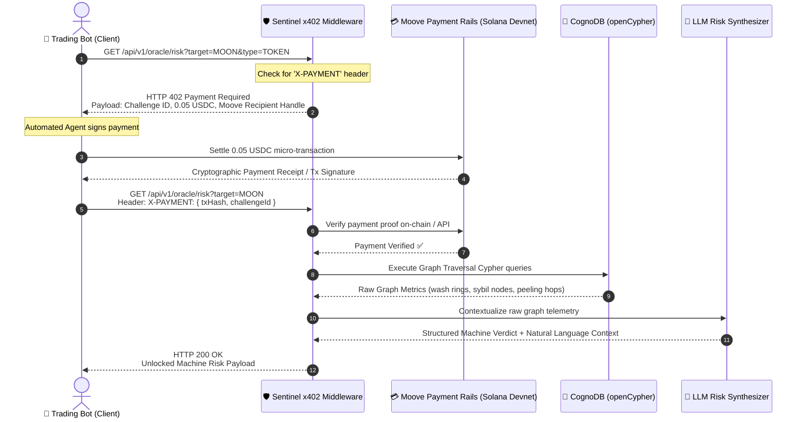

# 🛡️ Sentinel: The Agent-to-Agent x402 Risk Oracle

## Technical Architecture & Implementation Blueprint

---

## 1. Executive Summary & Value Proposition

- **Product:** Sentinel — Autonomous On-Chain Risk Oracle for AI Trading Agents.
- **Core Problem:** AI trading agents execute swaps autonomously on DEXs (e.g., Solana) based on price action and liquidity, making them vulnerable to on-chain fraud patterns like **Circular Wash-Trading Rings**, **Sybil Sniping Farms**, and **Laundering Peeling Chains**. Traditional APIs require KYC, credit cards, or human SaaS subscription management that autonomous agents cannot satisfy.
- **Solution:** Sentinel operates an autonomous Risk Oracle powered by a managed **CognoDB openCypher graph database** and an **LLM Reasoning Engine**.
- **Monetization (The x402 Protocol):** Sentinel exposes a machine-to-machine REST API monetized via **HTTP 402 "Payment Required"** micro-transactions settled through **Moove Agentic Payments** (e.g., $0.05 USDC per query).

---

## 2. End-to-End Sequence & Architecture



---

## 3. Protocol Specifications

### 3.1 The HTTP 402 Challenge Format

When an agent requests intelligence without paying, Sentinel halts execution and returns an HTTP 402:

```http
HTTP/1.1 402 Payment Required
Content-Type: application/json
X-Payment-Required: true
X-Payment-Protocol: moove-x402-v1

{
  "status": 402,
  "error": "Payment Required",
  "message": "Autonomous Risk Assessment requires an on-chain micro-payment.",
  "challenge": {
    "challengeId": "ch_984f1a20c3",
    "amount": 0.05,
    "currency": "USDC",
    "network": "solana-devnet",
    "recipient": "sentinel.moove",
    "recipientAddress": "SentinelTreasurySolanaDevnetAddress11111111",
    "validUntil": "2026-09-07T17:30:00Z",
    "instructions": {
      "headerName": "X-PAYMENT",
      "format": "JSON { challengeId, txSignature, payerAddress }"
    }
  }
}
```

### 3.2 The Settlement & `X-PAYMENT` Header

The client bot includes the receipt in the subsequent request:

```http
GET /api/v1/oracle/risk?target=MOON&type=TOKEN HTTP/1.1
Host: api.sentinel-oracle.com
X-PAYMENT: {"challengeId":"ch_984f1a20c3","txSignature":"5K9x...J8u2","payerAddress":"4vW2...7k9P"}
```

---

### 3.3 The Unlocked Machine-to-Machine Payload (HTTP 200)

```json
{
  "success": true,
  "paymentVerified": true,
  "receipt": {
    "txSignature": "5K9x...J8u2",
    "amount": 0.05,
    "currency": "USDC"
  },
  "oracleVerdict": {
    "canExecute": false,
    "verdict": "REJECT_SWAP",
    "riskScore": 94,
    "target": "MOON",
    "confidence": 0.98,
    "detectedAnomalies": [
      {
        "type": "SYBIL_SNIPING_FARM",
        "severity": "CRITICAL",
        "details": "Single mastermind wallet funded 12 bot wallets that executed coordinated swaps in the same block."
      },
      {
        "type": "CIRCULAR_WASH_RING",
        "severity": "HIGH",
        "details": "Detected 4-hop wash-trading loop cycling $19,940 artificial volume."
      }
    ]
  },
  "graphTelemetry": {
    "analyzedNodes": 43,
    "analyzedRelationships": 53,
    "sybilCount": 12,
    "washVolumeSol": 19940.0,
    "peelingHopsToCex": 6,
    "queryDurationMs": 18
  },
  "agentSemanticContext": "WARNING: $MOON liquidity is artificially generated. 92% of launch liquidity was purchased by a coordinated 12-wallet Sybil cluster funded by 🚨 Mastermind (Wash-Trader-Alpha). Executing this swap presents an extreme risk of a dump/rugpull."
}
```

---

## 4. Technical Stack

- **Backend Framework:** NestJS with strict TypeScript (zero `any`, TypeBox for DTO validation) or Express.js.
- **Runtime:** Bun (fast execution, native TypeScript, instant startup).
- **Graph Database:** CognoDB Cloud (openCypher dialect over Bolt protocol via official `neo4j-driver`).
- **Payment Settlement:** Moove Agentic Payments SDK / Verification API on Solana Devnet.
- **LLM Reasoning Engine:** OpenAI / Anthropic API (GPT-4o-mini / Claude 3.5 Sonnet) with structured JSON output.
- **Frontend:** Vite + React + Tailwind CSS + Lucide / Material Icons (Dual-mode: Telemetry Terminal + Client Bot Simulator).

---

## 5. Core CognoDB openCypher Queries

_(Optimized and verified for CognoDB openCypher)_

### 5.1 Wash-Trading Loop Traversal (Variable 2..6 Hops)

```cypher
MATCH (start:Wallet)-[r0:TRANSFERRED]->(mid:Wallet)-[path:TRANSFERRED*1..5]->(start)
WHERE ALL(r IN relationships(path) WHERE r.amount >= $minAmount) AND r0.amount >= $minAmount
WITH start, r0, mid, path, nodes(path) AS pathNodes, relationships(path) AS pathRels, (length(path) + 1) AS hopCount
RETURN
  start.address AS originAddress,
  hopCount,
  (r0.amount + reduce(total = 0.0, r IN pathRels | total + r.amount)) AS totalVolume,
  r0.tokenSymbol AS tokenSymbol
ORDER BY totalVolume DESC, hopCount ASC
LIMIT 10;
```

### 5.2 Sybil Bot Sniping Farm Aggregation

```cypher
MATCH (funder:Wallet)-[f:FUNDED]->(sybil:Wallet)-[s:SWAPPED]->(t:Token)
WHERE ($targetSymbol IS NULL OR t.symbol = $targetSymbol)
WITH funder, t, collect(DISTINCT sybil) AS sybilList, collect(DISTINCT f) AS fundingRels, collect(DISTINCT s) AS swapRels
WHERE size(sybilList) >= 3
RETURN
  funder.address AS funderAddress,
  funder.label AS funderLabel,
  t.symbol AS targetSymbol,
  size(sybilList) AS sybilCount,
  reduce(total = 0.0, r IN fundingRels | total + r.amount) AS totalFundedAmount
ORDER BY sybilCount DESC
LIMIT 10;
```

### 5.3 Peeling-Chain Exit Traversal

```cypher
MATCH (origin:Wallet)-[r0:TRANSFERRED]->(h1:Wallet)-[path:TRANSFERRED*1..5]->(dest:Exchange)
WHERE r0.amount >= $minStartAmount
WITH origin, r0, h1, path, dest, relationships(path) AS pathRels, (length(path) + 1) AS hopCount
RETURN
  origin.address AS originAddress,
  dest.label AS destinationLabel,
  r0.amount AS startAmount,
  last(pathRels).amount AS finalAmount,
  hopCount
ORDER BY hopCount DESC
LIMIT 10;
```

---

## 6. Project Directory Layout

```markdown
sentinel/
├── backend/
│ ├── src/
│ │ ├── common/
│ │ │ ├── guards/
│ │ │ │ └── x402-payment.guard.ts # Intercepts requests & triggers 402 challenge
│ │ │ ├── decorators/
│ │ │ │ └── require-payment.decorator.ts
│ │ │ └── filters/
│ │ ├── config/
│ │ ├── database/
│ │ │ └── cognoDB.service.ts # CognoDB driver connection & query runner
│ │ ├── moove/
│ │ │ └── moove.service.ts # Moove challenge issuer & tx verifier
│ │ ├── ai/
│ │ │ └── risk-reasoner.service.ts # LLM structured risk synthesizer
│ │ ├── oracle/
│ │ │ ├── oracle.controller.ts # /api/v1/oracle/risk endpoint
│ │ │ ├── oracle.service.ts # Orchestrates CognoDB + LLM + Verdict
│ │ │ └── dto/
│ │ ├── seed/
│ │ │ └── seed.service.ts # Realistic on-chain clusters for demo
│ │ ├── app.module.ts
│ │ └── main.ts
│ ├── package.json
│ └── tsconfig.json
├── client-agent/
│ └── demo-trader-bot.ts # Standalone CLI script demonstrating A2A 402 settlement
├── frontend/
│ ├── src/
│ │ ├── components/
│ │ │ ├── AgentSimulator.tsx # Interactive 1-click test agent for judges
│ │ │ ├── TelemetryStream.tsx # Live terminal feed of 402 micro-settlements
│ │ │ └── RiskRadar.tsx # Visual radar gauge of graph indicators
│ │ ├── App.tsx
│ │ └── main.tsx
│ ├── package.json
│ └── vite.config.ts
├── README.md
└── SENTINEL_BLUEPRINT.md
```

---

## 7. Step-by-Step Hackathon Demo Script (2 Minutes)

1. **The Hook (0:00 - 0:25):**

   > _"Autonomous AI trading agents are exploding, but they're blind to on-chain fraud like wash trading and sybil bot farms. Furthermore, they can't buy SaaS subscriptions or pass KYC. Sentinel solves this: it's an Agent-to-Agent Risk Oracle powered by CognoDB graph algorithms, monetized per query using HTTP 402 and Moove micro-payments."_

2. **The 402 Challenge in Action (0:25 - 0:55):**

   > _"Watch our simulated trading agent attempt to check token $MOON without paying. Sentinel immediately intercepts the request and responds with HTTP 402 Payment Required, providing a Moove payment descriptor for 0.05 USDC."_

3. **Autonomous Micro-Settlement (0:55 - 1:25):**

   > _"The client bot automatically signs and streams 0.05 USDC on Solana Devnet via the Moove SDK. Sentinel's middleware cryptographically verifies the on-chain receipt in real-time."_

4. **CognoDB Traversal & LLM Verdict (1:25 - 1:55):**
   > _"Once verified, CognoDB traverses circular wash-trading loops and 12-wallet sybil clusters in under 20 milliseconds. Our LLM synthesizes this into an actionable verdict: 'REJECT_SWAP - 94% Risk'. The trading bot saves its capital, and Sentinel earns 0.05 USDC autonomously."_
